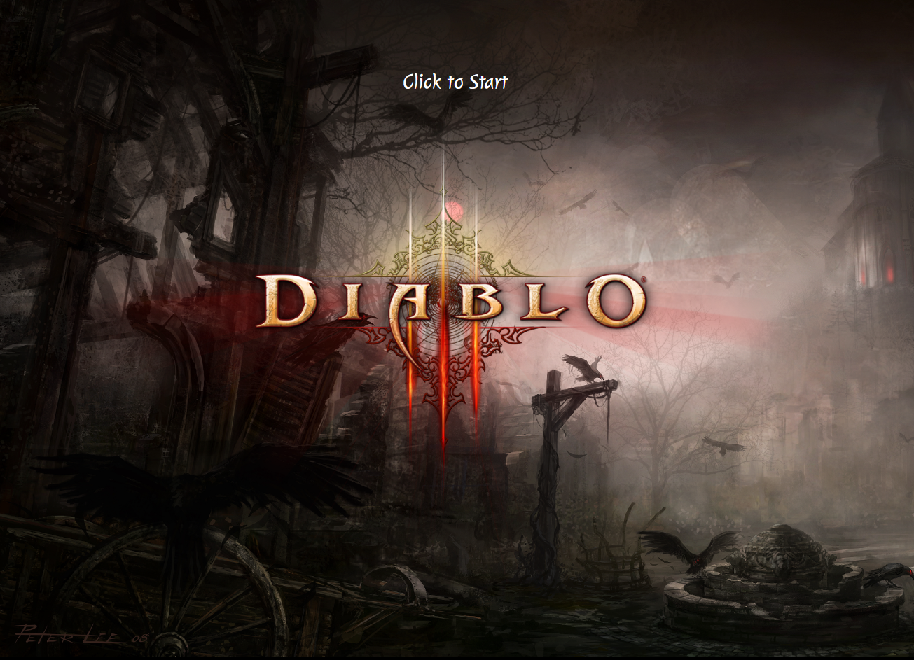
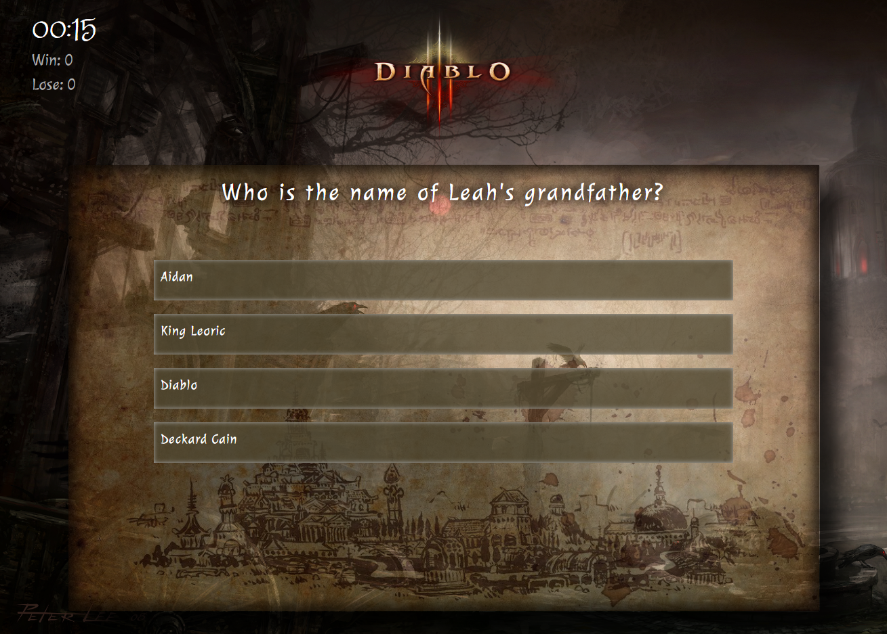
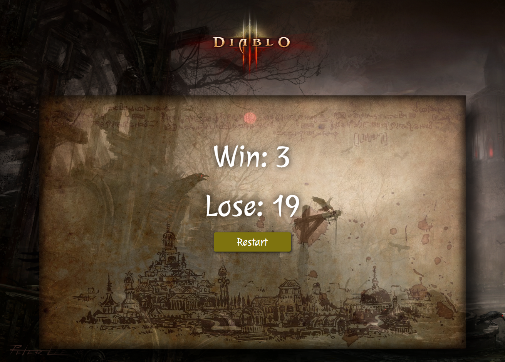

# TriviaGame

## _JavaScript_Assignment_2_
The fifth assignment of Columbia Coding Bootcamp. 

 
Link to Trivia Game:  
https://kitkat0202.github.io/TriviaGame/

    
# Finished Product:

    
# Project INFO:
- See how much you know about the Diablo lore with this trivia game

- To start click the Diablo Symbol and the timer will start along with the first question

- The timer will appear on the left corner with the score

- At the end trivia a total score will pop up and a restart button if you really want to re-play the trivia game

    
# Advanced Assignment (Timed Questions)

* You'll create a trivia game that shows only one question until the player answers it or their time runs out.

* If the player selects the correct answer, show a screen congratulating them for choosing the right option. After a few seconds, display the next question -- do this without user input.

* The scenario is similar for wrong answers and time-outs.

  * If the player runs out of time, tell the player that time's up and display the correct answer. Wait a few seconds, then show the next question.
  * If the player chooses the wrong answer, tell the player they selected the wrong option and then display the correct answer. Wait a few seconds, then show the next question.

* On the final screen, show the number of correct answers, incorrect answers, and an option to restart the game (without reloading the page).